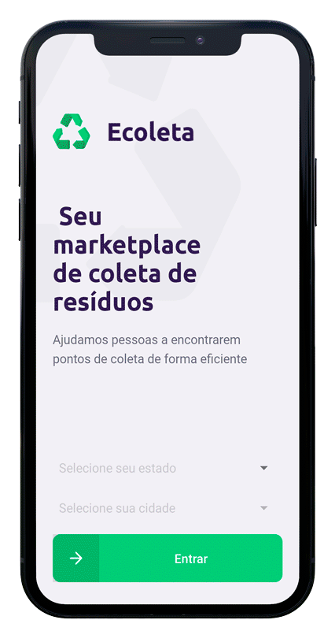
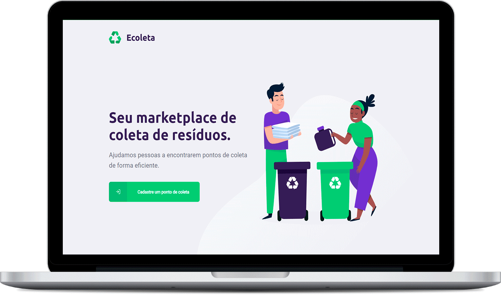

<div align="center">
	
</div>
<br/>
<br/>
<div align="center">
  
  <br/>
  <br/>
</div>


<p>
  <a href="#-sobre-o-projeto">💡 Sobre o projeto</a>
  <br/>
  <a href="#-tecnologias">🛸 Tecnologias</a>
   <br/>
  <a href="#-minhas-alterações">🧪 Minhas alterações</a>
   <br/>
  <a href="#-como-utilizar">⚙️ Como utilizar</a>
   <br/>
  <a href="#-variáveis-de-ambiente">🧩 Variáveis de ambiente</a>
   <br/>
  <a href="#-scripts">🤖 Scripts</a>
   <br/>
  <a href="#-como-contribuir">🖖🏻 Como contribuir</a>
   <br/>
  <a href="#-licença">📝 Licença</a>
</p>


# 💡 Sobre o projeto


O Ecoleta é uma solução que permite o cadastro de pontos de coletas por meio de uma página web e a divulgação destes pontos no aplicativo móvel.

<div align="center">
	
</div>

Desenvolvido durante a **Next Level Week #01**, créditos a [Rocketseat 🚀](https://github.com/Rocketseat)

<div align="center">
  
  </br>
  </br>
</div>


# 🛸 Tecnologias

* NodeJS

* ReactJS

* React Native

* Expo

* TypeScript

  

# 🧪 Minhas alterações

- Back-end:
  - Adicionei o Eslint e Prettier
  - Adicionei um filtro no Multer para aceitar apenas imagens com tamanho máximo de 1MB
  - Criei validações para todas as rotas utilizando o Celebrate
  - Adicionei o Jest ao projeto e escrevi testes de integração para todas as rotas bem como criei um banco de dados exclusivo para os testes
  - Adicionei variáveis de ambiente
- Front-end:
  - Adicionei Eslint e Prettier
  - Criei validações para todos campos do formulário usando o Yup
  - Criei validação para o tamanho da imagem
  - Alterei o favicon
  - Adicionei variáveis de ambiente
- Mobile:
  - Adicionei o Eslint e Prettier
  - Adicionei os selects na tela inicial utilizando o react-native-picker-select
  - Integrei a API do IBGE para buscar os nomes dos estados e cidades
  - Adicionei variáveis de ambiente


# ⚙️ Como utilizar

Clone o repositório:

```
git clone https://github.com/ViniciusMazon/Ecoleta.git
```

Instale as dependências:

📁./backend

```
yarn
```
📁./frontend

```
yarn
```
📁./mobile

```
yarn
```


**Desenvolvimento**

**Back-end:**

```
yarn dev
```

**Web:**

```
yarn start
```

**Mobile:**

```
yarn start
```


 **Teste**

**Back-end**:

```
yarn test
```


# 🧩 Variáveis de ambiente

**Back-end**

- `HOST`: O host da aplicação, por padrão `localhost`

- `PORT`: Selecione a porta em que deseja rodar a API, por padrão `3333`

- `IP`: O ip da máquina para rodar em modo dev

- `STORAGE_TYPE`: O tipo de armazenamento, por padrão `local`

**Front-end**

* `REACT_APP_BASE_URL`: A URL base, por padrão `http://localhost:3333/`

**Mobile**

* `BASE_URL`: A URL da API, por padrão o IP do EXPO, ex: `http://192.168.1.64:3333/`

  

# 🤖 Scripts

**Back-end:**

- `dev`: Roda a aplicação em modo de desenvolvimento
- `test`: Roda os testes automatizados
- `knex:migrate`: Roda as migrations
- `knex:seed`: Roda os seeds

**Front-end:**

- `start`: Roda a aplicação

**Mobile:**

- `start`: Roda a aplicação


# 🖖🏻 Como contribuir

- Faça um fork desse repositório;
- Clone esse repositório em sua máquina: `https://github.com/ViniciusMazon/Ecoleta.git`
- Cria uma branch com a sua feature: `git checkout -b minha-feature`;
- Faça commit das suas alterações: `git commit -m 'feat: Minha nova feature'`;
- Faça push para a sua branch: `git push origin minha-feature`.

Depois que o merge da sua pull request for feito, você pode deletar a sua branch.


# 📝 Licença

Esse projeto está sob a licença MIT. Veja o arquivo LICENSE para mais detalhes.

